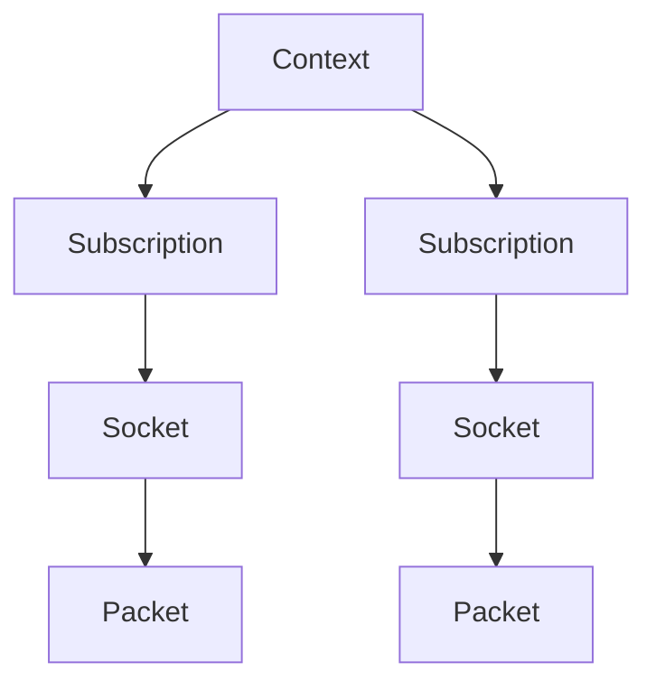
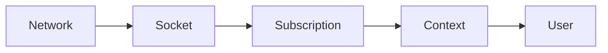

# Architecture

## Overview

## Core Concepts

### Context

The `Context` manages multiple multicast subscriptions.

Responsibilities:

- owns subscriptions
- provides fair receive across them
- aggregates context-level metrics
- manages lifecycle (`add`, `join`, `leave`, `remove`)

### Subscription

A `Subscription` represents one multicast receive path.

Responsibilities:

- owns or adopts a socket
- stores subscription configuration
- tracks lifecycle state
- performs non-blocking receive
- exposes per-subscription metrics snapshots

### Packet

A `Packet` represents one received UDP datagram plus metadata:

- subscription ID
- source address
- group address
- destination port
- payload

For integrations that need richer receive context, `PacketWithMetadata` wraps a
`Packet` together with a `ReceiveMetadata` struct. The current metadata surface
captures socket-level context plus pktinfo-style destination/interface details
on supported Unix and Windows IPv4 platforms, while still leaving room for
future expansion.

## Data Flow

## Why Context Exists

The `Context` is not just a container.

It provides:

- coordination across subscriptions
- fair round-robin receive
- batch receive helpers
- aggregated metrics
- a single integration point for higher-level systems

Without it, each caller would need to implement:

- polling loops
- fairness logic
- aggregation
- lifecycle management

## Architectural Model

- `Subscription` → data plane for one multicast flow
- `Context` → control plane for a group of subscriptions
- `platform` → socket lifecycle boundary for create/prepare/join/leave/recv operations
