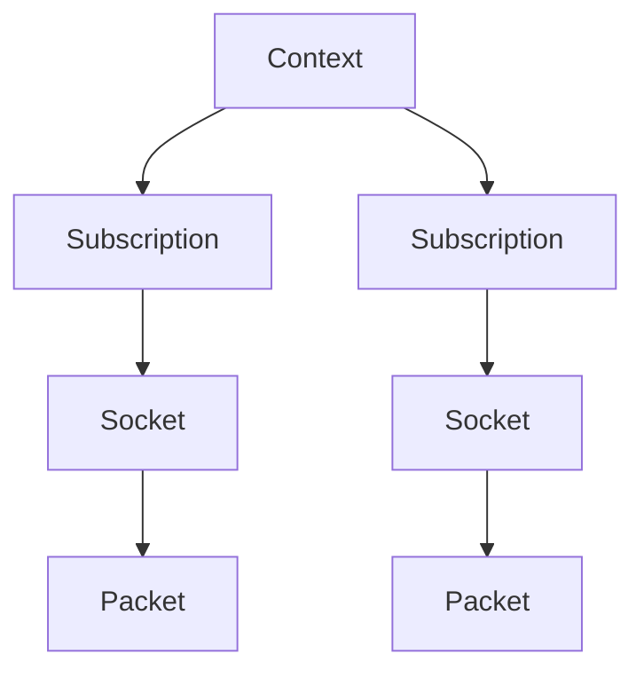
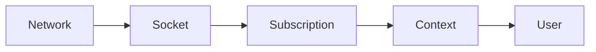

# Architecture

## Overview

## Core Types

### Context

`Context` manages a set of subscriptions.

Responsibilities:

- owns subscriptions
- coordinates join and leave operations
- provides fair receive across subscriptions
- offers batch receive helpers
- aggregates context-level metrics when enabled

### Subscription

`Subscription` models one multicast receive path.

Responsibilities:

- owns or adopts a socket
- stores subscription configuration
- tracks lifecycle state
- performs non-blocking receive
- exposes borrowing or ownership handoff paths for event-loop integration
- exposes per-subscription metrics snapshots when enabled

### Packet

`Packet` represents one received UDP datagram:

- subscription ID
- source address
- group address
- destination port
- payload

For integrations that need more delivery context, `PacketWithMetadata` wraps a
`Packet` together with optional receive metadata from the platform layer.

### Raw Receive

With the optional `raw-packets` feature enabled, the crate exposes a parallel
raw receive path for complete multicast IP datagrams. See
[Raw Packet Receive](raw-packets.md).

## Data Flow

## Why Context Exists

`Context` is more than a container. It centralizes:

- subscription lifecycle management
- fair round-robin receive
- batch draining helpers
- aggregation across subscriptions

Without it, each integration would need to rebuild those pieces around raw
sockets.

## Module Roles

- `subscription` → one multicast receive path
- `context` → orchestration across subscriptions
- `platform` → socket lifecycle, interface resolution, family-specific join/leave, and receive boundary
- `raw` → optional raw multicast IP datagram receive API
- `tokio_adapter` → optional async wrapper over an extracted subscription
